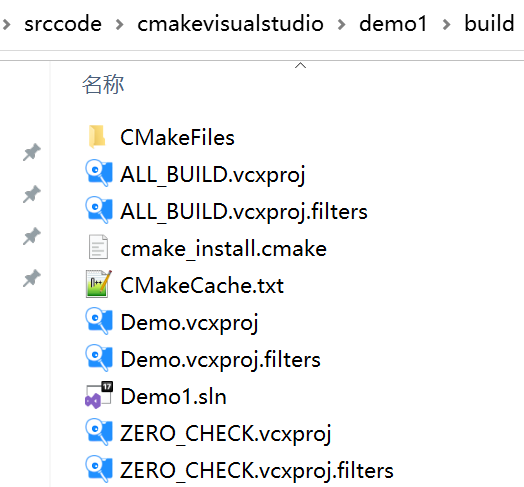

# CMake 结合 videostudio实战

为了方便快速构建项目，在windows平台下，使用CMake去管理项目。做一下CMake的实战笔记。

# 环境准备
去[CMake官网](https://cmake.org/download/)下载，安装好CMake。为了方便可以选择后续执行命令，可以选择将命令行加入到系统Path。

# 一、入门案例：单个源文件

> 本节对应的源代码所在目录：[Demo1](https://github.com/iherewaitfor/cmakevisualstudio/tree/main/demo1)

对于简单的项目，只需要写几行代码就可以了。例如，假设现在我们的项目中只有一个源文件 main.cpp ，该程序的用途是计算一个数的指数幂。

``` C++
#include <stdio.h>
#include <stdlib.h>

/**
 * power - Calculate the power of number.
 * @param base: Base value.
 * @param exponent: Exponent value.
 *
 * @return base raised to the power exponent.
 */
double power(double base, int exponent)
{
    double result = base;
    int i;
    
    if (exponent == 0) {
        return 1;
    }
    
    for(i = 1; i < exponent; ++i){
        result = result * base;
    }

    return result;
}

int main(int argc, char *argv[])
{
    if (argc < 3){
        printf("Usage: %s base exponent \n", argv[0]);
        return 1;
    }
    double base = atof(argv[1]);
    int exponent = atoi(argv[2]);
    double result = power(base, exponent);
    printf("%g ^ %d is %g\n", base, exponent, result);
    return 0;
}
```

#### 编写 CMakeLists.txt ####

首先编写 CMakeLists.txt 文件，并保存在与 main.cpp 源文件同个目录下：

``` plain
# CMake 最低版本号要求
cmake_minimum_required (VERSION 2.8)

# 项目信息
project (Demo1)

# 指定生成目标
add_executable(Demo main.cc)
```

CMakeLists.txt 的语法比较简单，由命令、注释和空格组成，其中命令是不区分大小写的。符号 `#` 后面的内容被认为是注释。命令由命令名称、小括号和参数组成，参数之间使用空格进行间隔。

对于上面的 CMakeLists.txt 文件，依次出现了几个命令：

1. `cmake_minimum_required`：指定运行此配置文件所需的 CMake 的最低版本；
2. `project`：参数值是 `Demo1`，该命令表示项目的名称是 `Demo1` 。
3. `add_executable`： 将名为 main.cc 的源文件编译成一个名称为 Demo 的可执行文件。

## 使用命令行生成video studio 的sln文件。
在demo1的目录下创建build文件夹。命令行进入到build。执行以下命令。其中可以通过 cmake -G help 查看各个版本的video studio怎么填写。
```
cmake .. -G "Visual Studio 17 2022"
```
执行结果如下。
```
D:\srccode\cmakevisualstudio\demo1\build>cmake .. -G "Visual Studio 17 2022"
CMake Deprecation Warning at CMakeLists.txt:2 (cmake_minimum_required):
  Compatibility with CMake < 2.8.12 will be removed from a future version of
  CMake.

  Update the VERSION argument <min> value or use a ...<max> suffix to tell
  CMake that the project does not need compatibility with older versions.


-- Selecting Windows SDK version 10.0.22621.0 to target Windows 10.0.19045.
-- The C compiler identification is MSVC 19.33.31630.0
-- The CXX compiler identification is MSVC 19.33.31630.0
-- Detecting C compiler ABI info
-- Detecting C compiler ABI info - done
-- Check for working C compiler: C:/Program Files/Microsoft Visual Studio/2022/Community/VC/Tools/MSVC/14.33.31629/bin/Hostx64/x64/cl.exe - skipped
-- Detecting C compile features
-- Detecting C compile features - done
-- Detecting CXX compiler ABI info
-- Detecting CXX compiler ABI info - done
-- Check for working CXX compiler: C:/Program Files/Microsoft Visual Studio/2022/Community/VC/Tools/MSVC/14.33.31629/bin/Hostx64/x64/cl.exe - skipped
-- Detecting CXX compile features
-- Detecting CXX compile features - done
-- Configuring done
-- Generating done
-- Build files have been written to: D:/srccode/cmakevisualstudio/demo1/build

D:\srccode\cmakevisualstudio\demo1\build>
```
执行完后，在build中生成了对应的工程文件.生成的文件列表如下。其中Demo1.sln即为解决方案文件。


## 使用CMakeGui生成video studio的sln文件。
1. 打开CMake-gui,souce code 选./demo1
2. "where to build the binaries:"选 ./demo1/build
3. 点击conigure，在弹窗中，选择对应的Visual Studio 版本
4. 点击Generate。就会在build目录生成对应的工程文件了。


生成的文件如下




# 二、同一目录，多个源文件

> 本小节对应的源代码所在目录：[Demo2](https://github.com/iherewaitfor/cmakevisualstudio/tree/main/Demo2)。

上面的例子只有单个源文件。现在假如把 `power` 函数单独写进一个名为 `MathFunctions.cpp` 的源文件里，使得这个工程变成如下的形式：

``` plain
./Demo2
    |
    +--- main.cpp
	|
	+--- MathFunctions.cpp
	|
	+--- MathFunctions.h
```

这个时候，CMakeLists.txt 可以改成如下的形式：

``` plain
# CMake 最低版本号要求
cmake_minimum_required (VERSION 2.8)

# 项目信息
project (Demo2)

# 指定生成目标
add_executable(Demo main.cpp MathFunctions.cpp)
```

唯一的改动只是在 `add_executable` 命令中增加了一个 `MathFunctions.cpp


` 源文件。这样写当然没什么问题，但是如果源文件很多，把所有源文件的名字都加进去将是一件烦人的工作。更省事的方法是使用 `aux_source_directory` 命令，该命令会查找指定目录下的所有源文件，然后将结果存进指定变量名。其语法如下：

```
aux_source_directory(<dir> <variable>)
```

因此，可以修改 CMakeLists.txt 如下：

``` plain
# CMake 最低版本号要求
cmake_minimum_required (VERSION 2.8)

# 项目信息
project (Demo2)

# 查找当前目录下的所有源文件
# 并将名称保存到 DIR_SRCS 变量
aux_source_directory(. DIR_SRCS)

# 指定生成目标
add_executable(Demo ${DIR_SRCS})
```

这样，CMake 会将当前目录所有源文件的文件名赋值给变量 `DIR_SRCS` ，再指示变量 `DIR_SRCS` 中的源文件需要编译成一个名称为 Demo 的可执行文件。


# 主要参考

https://www.hahack.com/codes/cmake/

https://github.com/wzpan/cmake-demo
