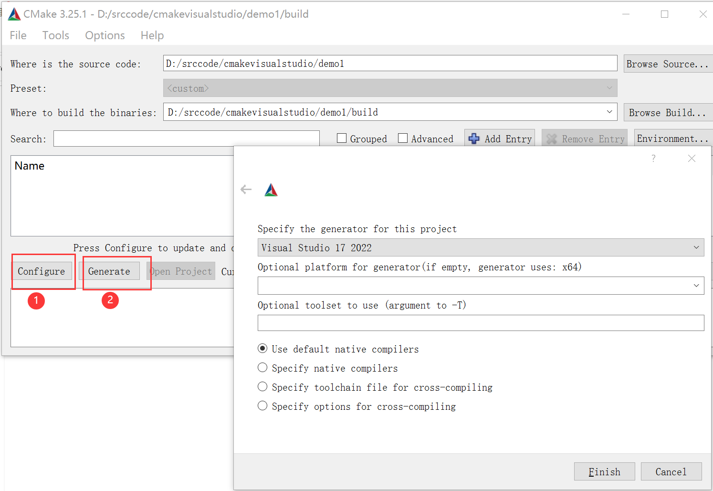

- [CMake 结合 Visual studio 实战](#cmake-结合-visual-studio-实战)
- [环境准备](#环境准备)
- [一、入门案例：单个源文件](#一入门案例单个源文件)
      - [编写 CMakeLists.txt](#编写-cmakeliststxt)
  - [使用命令行生成video studio 的sln文件。](#使用命令行生成video-studio-的sln文件)
  - [使用CMakeGui生成Visual Studio的sln文件。](#使用cmakegui生成visual-studio的sln文件)
- [二、同一目录，多个源文件](#二同一目录多个源文件)
- [3.1 多个目录，多个源文件](#31-多个目录多个源文件)
- [多个目录，多个源文件。动态链接库。](#多个目录多个源文件动态链接库)
  - [add\_custom\_command copy](#add_custom_command-copy)
- [四 自定义编译选项](#四-自定义编译选项)
      - [修改 CMakeLists 文件](#修改-cmakelists-文件)
      - [修改 main.cc 文件](#修改-maincc-文件)
      - [编写 config.h.in 文件](#编写-confighin-文件)
      - [编译项目](#编译项目)
        - [USE\_MYMATH 为 ON](#use_mymath-为-on)
        - [USE\_MYMATH 为 OFF](#use_mymath-为-off)
- [makefile中如何选择x64或x86](#makefile中如何选择x64或x86)
  - [使用CMAKE\_SIZEOF\_VOID\_P](#使用cmake_sizeof_void_p)
  - [使用CMAKE\_VS\_PLATFORM\_TOOLSET\_HOST\_ARCHITECTURE](#使用cmake_vs_platform_toolset_host_architecture)
- [常用命令](#常用命令)
  - [source\_group](#source_group)
- [主要参考](#主要参考)


# CMake 结合 Visual studio 实战

为了方便快速构建项目，在windows平台下，使用CMake去管理项目。做一下CMake的实战笔记。

# 环境准备
去[CMake官网](https://cmake.org/download/)下载，安装好CMake。为了方便可以选择后续执行命令，可以选择将命令行加入到系统Path。

# 一、入门案例：单个源文件

> 本节对应的源代码所在目录：[Demo1](https://github.com/iherewaitfor/cmakevisualstudio/tree/main/demo1)

对于简单的项目，只需要写几行代码就可以了。例如，假设现在我们的项目中只有一个源文件 main.cpp ，该程序的用途是计算一个数的指数幂。

``` C++
#include <stdio.h>
#include <stdlib.h>

/**
 * power - Calculate the power of number.
 * @param base: Base value.
 * @param exponent: Exponent value.
 *
 * @return base raised to the power exponent.
 */
double power(double base, int exponent)
{
    double result = base;
    int i;
    
    if (exponent == 0) {
        return 1;
    }
    
    for(i = 1; i < exponent; ++i){
        result = result * base;
    }

    return result;
}

int main(int argc, char *argv[])
{
    if (argc < 3){
        printf("Usage: %s base exponent \n", argv[0]);
        return 1;
    }
    double base = atof(argv[1]);
    int exponent = atoi(argv[2]);
    double result = power(base, exponent);
    printf("%g ^ %d is %g\n", base, exponent, result);
    return 0;
}
```

#### 编写 CMakeLists.txt ####

首先编写 CMakeLists.txt 文件，并保存在与 main.cpp 源文件同个目录下：

``` plain
# CMake 最低版本号要求
cmake_minimum_required (VERSION 2.8)

# 项目信息
project (Demo1)

# 指定生成目标
add_executable(Demo main.cc)
```

CMakeLists.txt 的语法比较简单，由命令、注释和空格组成，其中命令是不区分大小写的。符号 `#` 后面的内容被认为是注释。命令由命令名称、小括号和参数组成，参数之间使用空格进行间隔。

对于上面的 CMakeLists.txt 文件，依次出现了几个命令：

1. `cmake_minimum_required`：指定运行此配置文件所需的 CMake 的最低版本；
2. `project`：参数值是 `Demo1`，该命令表示项目的名称是 `Demo1` 。
3. `add_executable`： 将名为 main.cc 的源文件编译成一个名称为 Demo 的可执行文件。

## 使用命令行生成video studio 的sln文件。
在demo1的目录下创建build文件夹。命令行进入到build。执行以下命令。其中可以通过 cmake -G help 查看各个版本的video studio怎么填写。
```
cmake .. -G "Visual Studio 17 2022"
```
执行结果如下。
```
D:\srccode\cmakevisualstudio\demo1\build>cmake .. -G "Visual Studio 17 2022"
CMake Deprecation Warning at CMakeLists.txt:2 (cmake_minimum_required):
  Compatibility with CMake < 2.8.12 will be removed from a future version of
  CMake.

  Update the VERSION argument <min> value or use a ...<max> suffix to tell
  CMake that the project does not need compatibility with older versions.


-- Selecting Windows SDK version 10.0.22621.0 to target Windows 10.0.19045.
-- The C compiler identification is MSVC 19.33.31630.0
-- The CXX compiler identification is MSVC 19.33.31630.0
-- Detecting C compiler ABI info
-- Detecting C compiler ABI info - done
-- Check for working C compiler: C:/Program Files/Microsoft Visual Studio/2022/Community/VC/Tools/MSVC/14.33.31629/bin/Hostx64/x64/cl.exe - skipped
-- Detecting C compile features
-- Detecting C compile features - done
-- Detecting CXX compiler ABI info
-- Detecting CXX compiler ABI info - done
-- Check for working CXX compiler: C:/Program Files/Microsoft Visual Studio/2022/Community/VC/Tools/MSVC/14.33.31629/bin/Hostx64/x64/cl.exe - skipped
-- Detecting CXX compile features
-- Detecting CXX compile features - done
-- Configuring done
-- Generating done
-- Build files have been written to: D:/srccode/cmakevisualstudio/demo1/build

D:\srccode\cmakevisualstudio\demo1\build>
```
执行完后，在build中生成了对应的工程文件.生成的文件列表如下。其中Demo1.sln即为解决方案文件。


使用命令行完成编译
```
D:\srccode\cmakevisualstudio\demo2\build>cmake --build .
MSBuild version 17.3.1+2badb37d1 for .NET Framework
  Checking Build System
  Building Custom Rule D:/srccode/cmakevisualstudio/demo2/CMakeLists.txt
  MathFunctions.cpp
  main.cpp
  正在生成代码...
  Demo.vcxproj -> D:\srccode\cmakevisualstudio\demo2\build\Debug\Demo.exe
  Building Custom Rule D:/srccode/cmakevisualstudio/demo2/CMakeLists.txt

D:\srccode\cmakevisualstudio\demo2\build>.\Debug\Demo.exe 2 3
2 ^ 3 is 8

D:\srccode\cmakevisualstudio\demo2\build>
```

## 使用CMakeGui生成Visual Studio的sln文件。
1. 打开CMake-gui,souce code 选./demo1
2. "where to build the binaries:"选 ./demo1/build
3. 点击conigure，在弹窗中，选择对应的Visual Studio 版本
4. 点击Generate。就会在build目录生成对应的工程文件了。



生成的文件如下


# 二、同一目录，多个源文件

> 本小节对应的源代码所在目录：[Demo2](https://github.com/iherewaitfor/cmakevisualstudio/tree/main/Demo2)。

上面的例子只有单个源文件。现在假如把 `power` 函数单独写进一个名为 `MathFunctions.cpp` 的源文件里，使得这个工程变成如下的形式：

``` plain
./Demo2
    |
    +--- main.cpp
	|
	+--- MathFunctions.cpp
	|
	+--- MathFunctions.h
```

这个时候，CMakeLists.txt 可以改成如下的形式：

``` plain
# CMake 最低版本号要求
cmake_minimum_required (VERSION 2.8)

# 项目信息
project (Demo2)

# 指定生成目标
add_executable(Demo main.cpp MathFunctions.cpp)
```

唯一的改动只是在 `add_executable` 命令中增加了一个 `MathFunctions.cpp


` 源文件。这样写当然没什么问题，但是如果源文件很多，把所有源文件的名字都加进去将是一件烦人的工作。更省事的方法是使用 `aux_source_directory` 命令，该命令会查找指定目录下的所有源文件，然后将结果存进指定变量名。其语法如下：

```
aux_source_directory(<dir> <variable>)
```

因此，可以修改 CMakeLists.txt 如下：

``` plain
# CMake 最低版本号要求
cmake_minimum_required (VERSION 2.8)

# 项目信息
project (Demo2)

# 查找当前目录下的所有源文件
# 并将名称保存到 DIR_SRCS 变量
aux_source_directory(. DIR_SRCS)

# 指定生成目标
add_executable(Demo ${DIR_SRCS})
```

这样，CMake 会将当前目录所有源文件的文件名赋值给变量 `DIR_SRCS` ，再指示变量 `DIR_SRCS` 中的源文件需要编译成一个名称为 Demo 的可执行文件。

# 3.1 多个目录，多个源文件
> 本小节对应的源代码所在目录：[Demo3](https://github.com/iherewaitfor/cmakevisualstudio/tree/main/Demo3)。

现在进一步将 MathFunctions.h 和 MathFunctions.cpp 文件移动到 math 目录下。 

``` plain
./Demo3
    |
    +--- main.cc
	|
	+--- math/
	      |
	      +--- MathFunctions.cpp
	      |
	      +--- MathFunctions.h
```
对于这种情况，需要分别在项目根目录 Demo3 和 math 目录里各编写一个 CMakeLists.txt 文件。为了方便，我们可以先将 math 目录里的文件编译成静态库再由 main 函数调用。

根目录中的 CMakeLists.txt ：

``` plain
# CMake 最低版本号要求
cmake_minimum_required (VERSION 2.8)

# 项目信息
project (Demo3)

# 查找当前目录下的所有源文件
# 并将名称保存到 DIR_SRCS 变量
aux_source_directory(. DIR_SRCS)

# 添加 math 子目录
add_subdirectory(math)

# 指定生成目标 
add_executable(Demo main.cpp)

# 添加链接库
target_link_libraries(Demo MathFunctions)
```

该文件添加了下面的内容: 第 3 行，使用命令 `add_subdirectory` 指明本项目包含一个子目录 math，这样 math 目录下的 CMakeLists.txt 文件和源代码也会被处理 。第 18 行，使用命令 `target_link_libraries` 指明可执行文件 main 需要连接一个名为 MathFunctions 的链接库 。

子目录中的 CMakeLists.txt：

``` plain
# 查找当前目录下的所有源文件
# 并将名称保存到 DIR_LIB_SRCS 变量
aux_source_directory(. DIR_LIB_SRCS)

# 生成链接库
add_library (MathFunctions ${DIR_LIB_SRCS})
```

在该文件中使用命令 `add_library` 将 src 目录中的源文件编译为静态链接库。

# 多个目录，多个源文件。动态链接库。
> 本小节对应的源代码所在目录：[Demo3—_1](https://github.com/iherewaitfor/cmakevisualstudio/tree/main/Demo3_1)。

现在进一步将 MathFunctions.h 和 MathFunctions.cpp 文件移动到 math 目录下。 

``` plain
./Demo3
    |
    +--- main.cc
	|
	+--- math/
	      |
	      +--- MathFunctions.cpp
	      |
	      +--- MathFunctions.h
```

先修改.h和.cpp，修改为dll导出函数.

MathFunctions.h

``` c++
#ifndef POWER_H
#define POWER_H

#ifdef MATHFUNCIONS
	#define MY_LIB_API __declspec(dllexport)
#else
	#define MY_LIB_API __declspec(dllimport)
#endif
MY_LIB_API double  power(double base, int exponent);

#endif
```
其中根据是否有宏定义MATHFUNCIONS，来定义导出还是导入。 在MathFuncions动态库项目中定义宏MATHFUNCIONS。

cpp中定义导出函数。

MathFunctions.cpp

``` C++
#include "MathFunctions.h"
/**
 * power - Calculate the power of number.
 * @param base:	Base value.
 * @param exponent: Exponent value.
 *
 * @return base raised to the power exponent.
 */
MY_LIB_API double power(double base, int exponent)
{
    double result = base;
    int i;

    if (exponent == 0) {
        return 1;
    }
    
    for(i = 1; i < exponent; ++i){
        result = result * base;
    }

    return result;
}
```

math/CMakeLists.txt文件中做两个关键修改
- 定义宏MATHFUNCIONS.
```
add_definitions("-DMATHFUNCIONS" "-D_MATHFUNCIONS")
```
- 定义为动态链接库，使用了关键字SHARED
```
add_library(MathFunctions SHARED ${DIR_LIB_SRCS})
```
完整的math/CMakeLists.txt内容如下：
```
# 查找目录下的所有源文件
# 并将名称保存到DIR_LIB_SRCS变量
aux_source_directory(. DIR_LIB_SRCS)
add_definitions("-DMATHFUNCIONS" "-D_MATHFUNCIONS")

# 指定生成MathFunctions链接库
add_library(MathFunctions SHARED ${DIR_LIB_SRCS})
```

此时编译MathFuncitons项目时，会同时生成MathFuncitons.dll和MathFuncitons.lib。
到时运行Demo.exe时，需要把MathFuncitons.dll放到Demo.exe的同目录。Demo.exe运行需要依赖MathFuncitons.dll动态库。

## add_custom_command copy
添加自定义命令。在Demo.exe生成后，自动 将其依赖的MathFunctions.dll动态 链接库复制到Demo.exe的同一个目录下。通过 $<CONFIGURATION>自动匹配Deubg/Release。
另外PROJECT_BINARY_DIR 表示运行cmake命令的目录，通常为build目录。
```
# PROJECT_BINARY_DIR 表示运行cmake命令的目录，通常为build目录
# $<CONFIGURATION>根据实际配置，为Debug或者Release
# 该命令用于在Demo.exe项目生成后，自动将其依赖的MathFunctions.dll动态链接库复制到Demo.exe的同一个文件夹下。
 
add_custom_command(TARGET Demo
  POST_BUILD
  COMMAND ${CMAKE_COMMAND} -E copy ${PROJECT_BINARY_DIR}/math/$<CONFIGURATION>/MathFunctions.dll ${PROJECT_BINARY_DIR}/$<CONFIGURATION>
  )
```

# 四 自定义编译选项
> 本小节对应的源代码所在目录：[Demo4](https://github.com/iherewaitfor/cmakevisualstudio/tree/main/Demo4)。

CMake 允许为项目增加编译选项，从而可以根据用户的环境和需求选择最合适的编译方案。

例如，可以将 MathFunctions 库设为一个可选的库，如果该选项为 `ON` ，就使用该库定义的数学函数来进行运算。否则就调用标准库中的数学函数库。

#### 修改 CMakeLists 文件 ####

我们要做的第一步是在顶层的 CMakeLists.txt 文件中添加该选项：

``` plain
# CMake 最低版本号要求
cmake_minimum_required (VERSION 2.8)

# 项目信息
project (Demo4)

# 加入一个配置头文件，用于处理 CMake 对源码的设置
configure_file (
  "${PROJECT_SOURCE_DIR}/config.h.in"
  "${PROJECT_BINARY_DIR}/config.h"
  )

# 是否使用自己的 MathFunctions 库
option (USE_MYMATH
	   "Use provided math implementation" ON)

# 是否加入 MathFunctions 库
if (USE_MYMATH)
  include_directories ("${PROJECT_SOURCE_DIR}/math")
  add_subdirectory (math)  
  set (EXTRA_LIBS ${EXTRA_LIBS} MathFunctions)
endif (USE_MYMATH)

# 查找当前目录下的所有源文件
# 并将名称保存到 DIR_SRCS 变量
aux_source_directory(. DIR_SRCS)

# 指定生成目标
add_executable(Demo ${DIR_SRCS})
target_link_libraries (Demo  ${EXTRA_LIBS})
```

其中：

1. 第7行的 `configure_file` 命令用于加入一个配置头文件 config.h ，这个文件由 CMake 从 config.h.in 生成，通过这样的机制，将可以通过预定义一些参数和变量来控制代码的生成。
2. 第13行的 `option` 命令添加了一个 `USE_MYMATH` 选项，并且默认值为 `ON` 。
3. 第17行根据 `USE_MYMATH` 变量的值来决定是否使用我们自己编写的 MathFunctions 库。

#### 修改 main.cc 文件 ####

之后修改 main.cc 文件，让其根据 `USE_MYMATH` 的预定义值来决定是否调用标准库还是 MathFunctions 库：

``` plain
#include <stdio.h>
#include <stdlib.h>
#include "config.h"

#ifdef USE_MYMATH
  #include "math/MathFunctions.h"
#else
  #include <math.h>
#endif


int main(int argc, char *argv[])
{
    if (argc < 3){
        printf("Usage: %s base exponent \n", argv[0]);
        return 1;
    }
    double base = atof(argv[1]);
    int exponent = atoi(argv[2]);
    
#ifdef USE_MYMATH
    printf("Now we use our own Math library. \n");
    double result = power(base, exponent);
#else
    printf("Now we use the standard library. \n");
    double result = pow(base, exponent);
#endif
    printf("%g ^ %d is %g\n", base, exponent, result);
    return 0;
}
```

#### 编写 config.h.in 文件 ####

上面的程序值得注意的是第2行，这里引用了一个 config.h 文件，这个文件预定义了 `USE_MYMATH` 的值。但我们并不直接编写这个文件，为了方便从 CMakeLists.txt 中导入配置，我们编写一个 config.h.in 文件，内容如下：

``` plain
#cmakedefine USE_MYMATH
```

这样 CMake 会自动根据 CMakeLists 配置文件中的设置自动生成 config.h 文件。

#### 编译项目 ####

现在编译一下这个项目，为了便于交互式的选择该变量的值，可以使用
  -  cmake-gui进行配置。选择勾选不勾选USE_MYMATH选项生成项目。

  - 或者使用命令行加上-D选项，直接设置USE_MYMATH的值。
```
D:\srccode\cmakevisualstudio\demo4\build>cmake .. -D USE_MYMATH=OFF -G "Visual Studio 17 2022" -A Win32
```

可以试试分别将 `USE_MYMATH` 设为 `ON` 和 `OFF` 得到的结果：

##### USE_MYMATH 为 ON #####

运行结果：

``` plain
[ehome@xman Demo4]$ ./Demo
Now we use our own MathFunctions library. 
 7 ^ 3 = 343.000000
 10 ^ 5 = 100000.000000
 2 ^ 10 = 1024.000000
```

此时 config.h 的内容为：

``` plain
#define USE_MYMATH
```

##### USE_MYMATH 为 OFF #####

运行结果：

``` plain
[ehome@xman Demo4]$ ./Demo
Now we use the standard library. 
 7 ^ 3 = 343.000000
 10 ^ 5 = 100000.000000
 2 ^ 10 = 1024.000000
```

此时 config.h 的内容为空。

``` plain
/* #undef USE_MYMATH */
```

也可以通过修改config.h.in文件。写上
``` plain
#cmakedefine USE_MYMATH
```
时表示USE_MYMATH为ON。把该行注释掉。或者删掉，则表示USE_MYMATH为OFF。可以使用以下命令行生成项目。
```
D:\srccode\cmakevisualstudio\demo4\build>cmake .. -G "Visual Studio 17 2022" -A Win32
```
# makefile中如何选择x64或x86
## 使用CMAKE_SIZEOF_VOID_P
CMAKE_SIZEOF_VOID_P: 如果是64位，值为8（表示8个字节）;如果32位，值为4。
可以通过变量值判断，来进行对应库选择。
参考
[https://cmake.org/cmake/help/latest/variable/CMAKE_SIZEOF_VOID_P.html#variable:CMAKE_SIZEOF_VOID_P](https://cmake.org/cmake/help/latest/variable/CMAKE_SIZEOF_VOID_P.html#variable:CMAKE_SIZEOF_VOID_P)

CMAKE控制流逻辑参考

[https://cmake.org/cmake/help/latest/command/if.html#command:if](https://cmake.org/cmake/help/latest/command/if.html#command:if)

[https://cmake.org/cmake/help/latest/manual/cmake-language.7.html](https://cmake.org/cmake/help/latest/manual/cmake-language.7.html)

```
#CMAKE_SIZEOF_VOID_P: 如果是64位，值为8（表示8个字节）;如果32位，值为4。
#This is set to the size of a pointer(in byte) on the target machine, and is determined by a try compile. If a 64-bit size is found, then the library search #path is modified to look for 64-bit libraries first.
if(CMAKE_SIZEOF_VOID_P EQUAL 8)
	link_directories(${PROJECT_SOURCE_DIR}/../../Lib/x64)
else()
	link_directories(${PROJECT_SOURCE_DIR}/../../Lib/x86)
endif()
```

## 使用CMAKE_VS_PLATFORM_TOOLSET_HOST_ARCHITECTURE
CMAKE_VS_PLATFORM_TOOLSET_HOST_ARCHITECTURE变量的值直接为x86 或者是x64

```
#https://cmake.org/cmake/help/latest/variable/CMAKE_VS_PLATFORM_TOOLSET_HOST_ARCHITECTURE.html
#vs2013及以上可以使用变量CMAKE_VS_PLATFORM_TOOLSET_HOST_ARCHITECTURE
link_directories(${PROJECT_SOURCE_DIR}/../../Lib/${CMAKE_VS_PLATFORM_TOOLSET_HOST_ARCHITECTURE})
```

# 常用命令
cmake命令官方文档。
[https://cmake.org/cmake/help/latest/manual/cmake-commands.7.html](https://cmake.org/cmake/help/latest/manual/cmake-commands.7.html)

## source_group
[https://cmake.org/cmake/help/latest/command/source_group.html](
https://cmake.org/cmake/help/latest/command/source_group.html)

使用示例：
```
set(SHARED_RESOURCES_SRCS
../shared/resources/win/big.ico
../shared/resources/win/resource.h
../shared/resources/win/shared.rc
../shared/resources/win/small.ico
)
source_group("shared/resources/win" FILES ${SHARED_RESOURCES_SRCS})
```


# 主要参考

[https://www.hahack.com/codes/cmake/](https://www.hahack.com/codes/cmake/)

[https://github.com/wzpan/cmake-demo](https://www.hahack.com/codes/cmake/)


[https://cmake.org/cmake/help/latest/manual/cmake-variables.7.html](https://cmake.org/cmake/help/latest/manual/cmake-variables.7.html)

[https://cmake.org/cmake/help/latest/manual/cmake-commands.7.html](https://cmake.org/cmake/help/latest/manual/cmake-commands.7.html)

[https://cmake.org/cmake/help/latest/manual/cmake-language.7.html](https://cmake.org/cmake/help/latest/manual/cmake-language.7.html)

